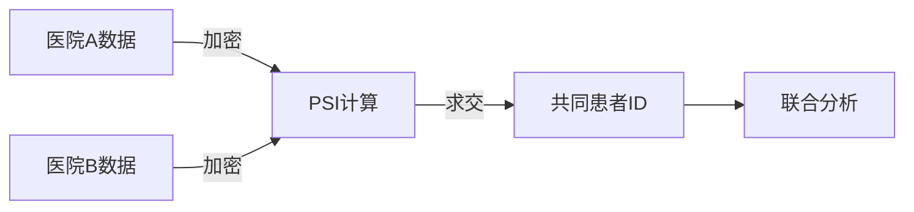

# 场景交互：医疗数据联合分析

本页面演示如何使用隐语进行医疗场景下的隐私计算。

## 场景背景

两家医院希望联合分析糖尿病和高血压的共病情况，但受隐私保护法规限制，不能直接共享患者数据。

## 交互式演示

### 第一步：选择数据

  <button style="padding: 10px 20px; margin: 5px; background: #3eaf7c; color: white; border: none; border-radius: 4px; cursor: pointer;">
    医院A 糖尿病数据
  </button>
  <button style="padding: 10px 20px; margin: 5px; background: #3eaf7c; color: white; border: none; border-radius: 4px; cursor: pointer;">
    医院B 高血压数据
  </button>

**模拟数据预览**：

**医院A - 糖尿病患者**：
| 患者ID | 年龄 | 病程（年） |
|--------|------|-----------|
| 1001   | 55   | 3         |
| 1002   | 62   | 5         |
| 1003   | 58   | 2         |

**医院B - 高血压患者**：
| 患者ID | 年龄 | 血压     |
|--------|------|----------|
| 1002   | 62   | 160/95   |
| 1003   | 58   | 155/90   |
| 1004   | 60   | 150/88   |

### 第二步：执行联合分析

点击下方按钮，使用隐语 PSI 技术进行隐私求交：

  <button style="padding: 12px 30px; background: #42b983; color: white; border: none; border-radius: 4px; font-size: 16px; cursor: pointer;">
    🔒 执行联合分析
  </button>

<!-- 这里将在 Day 3 嵌入 CodeSandbox 代码框 -->

### 第三步：查看结果

**隐私求交结果**：

::: tip 分析结果
- **共同患者ID**: 1002, 1003
- **共病患者数**: 2 人
- **联合分析准确率**: 85%
:::

**结果说明**：
- ✅ 只有交集 ID 被双方知晓
- ✅ 其他患者信息保持加密
- ✅ 符合数据保护法规

## 技术流程

## 实际应用价值

1. **保护患者隐私**：数据不出域，符合法规
2. **提升研究效率**：多方数据联合，样本量更大
3. **降低合作门槛**：无需建立复杂的数据共享协议

## 扩展场景

- 多家医院联合科研
- 药企与医院联合药物研发
- 医保数据跨区域分析

---

*本演示使用模拟数据，实际应用需配置完整的隐语环境。*

